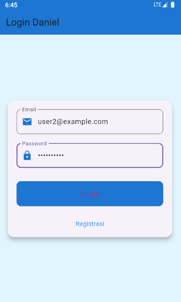
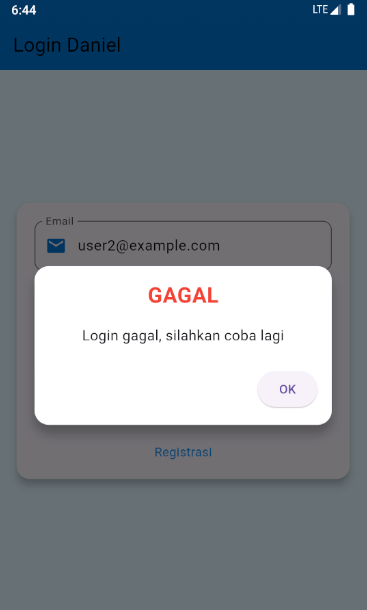
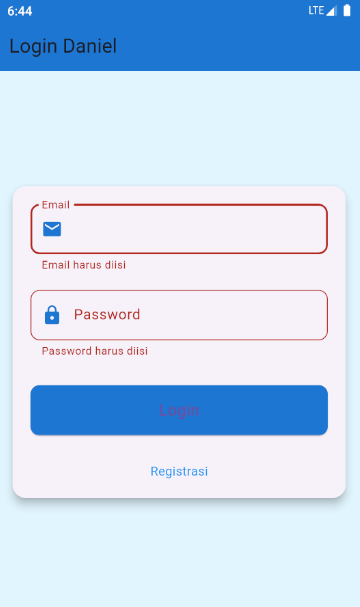
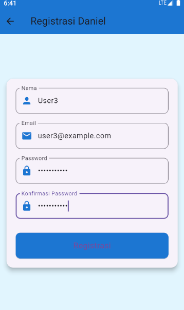
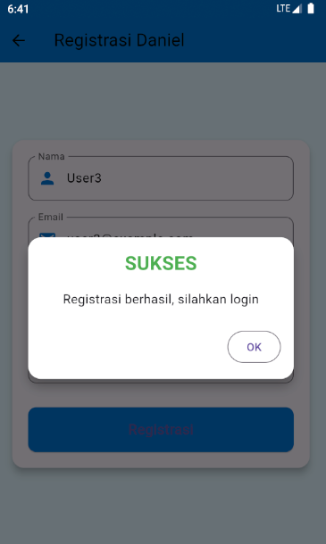
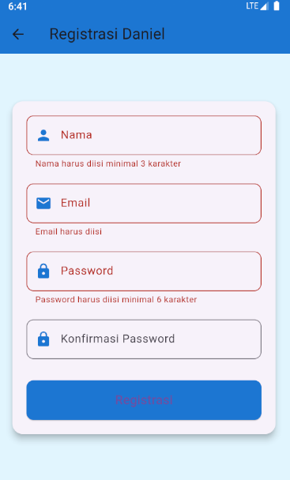
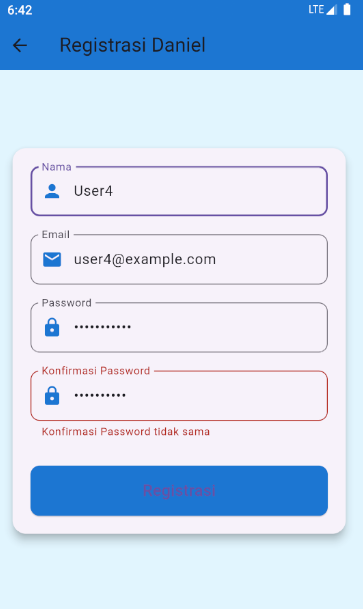

# Tokokita

Tugas Pertemuan 5 Praktikum Pemrograman Mobile Shift C

Nama : Daniel Abdillah Arif

NIM : H1D022055

## Screenshot Tampilan UI dan Penjelasan

- Halaman Login

1. Melakukan proses Login

User melakukan proses login dengan menginputkan alamat email dan password pada form login yang disediakan. Alamat email dan password yang diinput merupakan alamat email dan password yang sebelumnya telah didaftarkan oleh user melalui proses registrasi.

Apabila user melakukan login dengan data yang benar, maka setelah menekan tombol login, pengguna akan diarahkan ke halaman Daftar Produk. Apabila salah menginputkan data atau belum mengisi form, maka hasilnya akan menjadi:

- Halaman Registrasi

1. Melakukan proses Registrasi

Sebelum melakukan proses Login, user yang belum pernah membuat akun dapat melakukan proses Registrasi terlebih dahulu dengan menekan tulisan "registrasi" pada halaman Login.

Pada halaman registrasi, user dapat membuat akun baru dengan mengisi form registrasi yang berisi kolom nama/username, alamat email, password, dan konfirmasi password.

Apabila user melakukan registrasi dengan benar dan menekan tombol Registrasi, maka akan muncul notifikasi sebagai tanda bahwa proses registrasi berhasil dilakukan, kemudian user akan diarahkan ke halaman Login untuk melakukan login.

Namun, apabila user menekan tombol registrasi dengan mengosongi kolom, atau salah mengisi kolom konfirmasi password, maka akan muncul tampilan:

