# Tokokita

Tugas Pertemuan 5 Praktikum Pemrograman Mobile Shift C

Nama : Daniel Abdillah Arif

NIM : H1D022055

## Screenshot Tampilan UI dan Penjelasan

- Halaman Login

Melakukan proses Login

User melakukan proses login dengan menginputkan alamat email dan password pada form login yang disediakan. Alamat email dan password yang diinput merupakan alamat email dan password yang sebelumnya telah didaftarkan oleh user melalui proses registrasi.

Apabila user melakukan login dengan data yang benar, maka setelah menekan tombol login, pengguna akan diarahkan ke halaman Daftar Produk. Apabila salah menginputkan data atau belum mengisi form, maka hasilnya akan menjadi:

Berikut adalah baris kode yang mengelola proses login dengan menampilkan status loading, memvalidasi hasil login, menyimpan token dan ID pengguna jika login berhasil, serta menampilkan pesan kesalahan jika gagal.

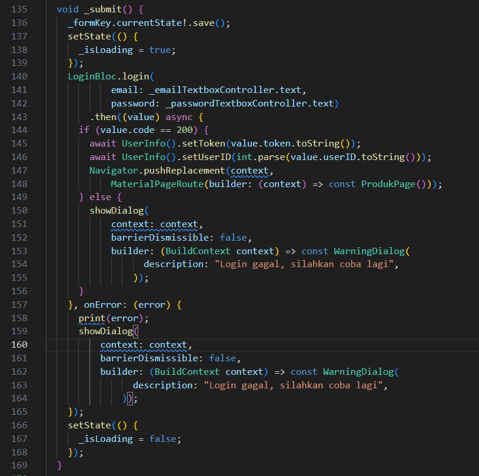

- Halaman Registrasi

Melakukan proses Registrasi

Sebelum melakukan proses Login, user yang belum pernah membuat akun dapat melakukan proses Registrasi terlebih dahulu dengan menekan tulisan "registrasi" pada halaman Login.

Pada halaman registrasi, user dapat membuat akun baru dengan mengisi form registrasi yang berisi kolom nama/username, alamat email, password, dan konfirmasi password.

Apabila user melakukan registrasi dengan benar dan menekan tombol Registrasi, maka akan muncul notifikasi sebagai tanda bahwa proses registrasi berhasil dilakukan, kemudian user akan diarahkan ke halaman Login untuk melakukan login.

Namun, apabila user menekan tombol registrasi dengan mengosongi kolom, atau salah mengisi kolom konfirmasi password, maka akan muncul tampilan:

Berikut adalah baris kode yang mengelola proses registrasi dengan menampilkan indikator loading saat registrasi berlangsung, menampilkan pesan sukses jika registrasi berhasil, dan menampilkan pesan error jika registrasi gagal.

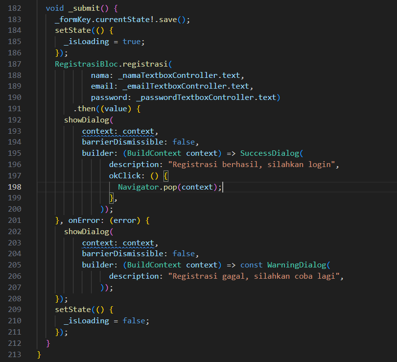

- Halaman Daftar Produk

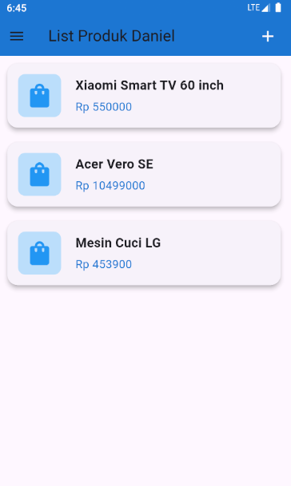

Pada halaman daftar produk, ditampilkan daftar produk yang ada pada database dengan ditempatkan pada card tersendiri. Pada halaman ini pengguna dapat menekan ikon "+" yang ada di pojok kanan atas halaman untuk mengakses halaman tambah produk. Pengguna juga dapat mengakses sidemenu dengan menekan ikon garis tiga pada pojok kiri atas halaman.

Berikut adalah baris kode untuk menampilkan daftar produk. Kelas ListProduk bertugas menampilkan daftar produk secara dinamis menggunakan widget ListView.builder. Jika daftar list kosong atau null, tidak ada item yang akan ditampilkan. Setiap elemen dalam daftar list dipetakan ke dalam widget ItemProduk yang menampilkan detail produk tertentu.

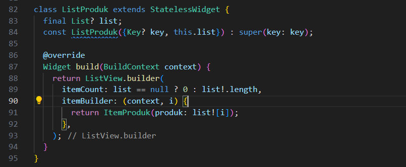

Berikut adalah baris kode yang membuat card untuk daftar produk yang ditampilkan. Kelas ItemProduk bertugas untuk menampilkan informasi produk dalam bentuk kartu, termasuk ikon produk, nama produk, dan harga produk. Ketika pengguna mengetuk kartu, aplikasi akan menavigasi ke halaman detail produk menggunakan Navigator.push.

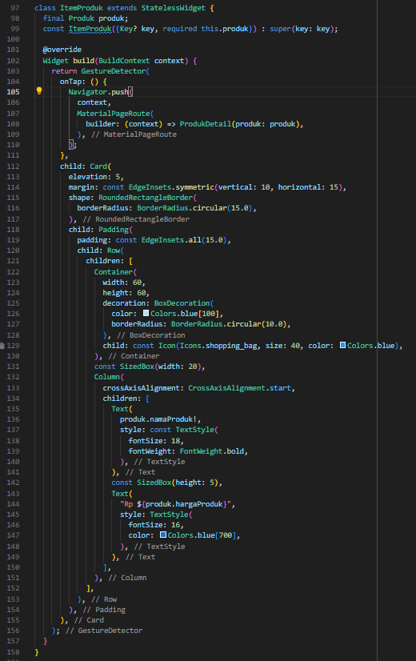

- Sidemenu

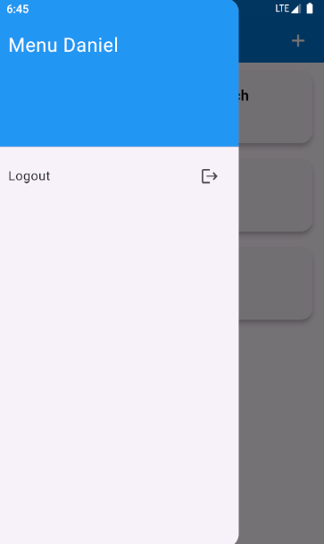

Pada sidemenu terdapat menu untuk melakukan logout. Apabila user melakukan logout, user akan dialihkan ke halaman Login dan sesi user akan diakhiri.

Berikut adalah baris kode untuk menampilkan sebuah Drawer dengan judul "Menu Daniel" dan sebuah menu ListTile untuk melakukan logout dan mengarahkan pengguna kembali ke halaman login setelah logout berhasil.

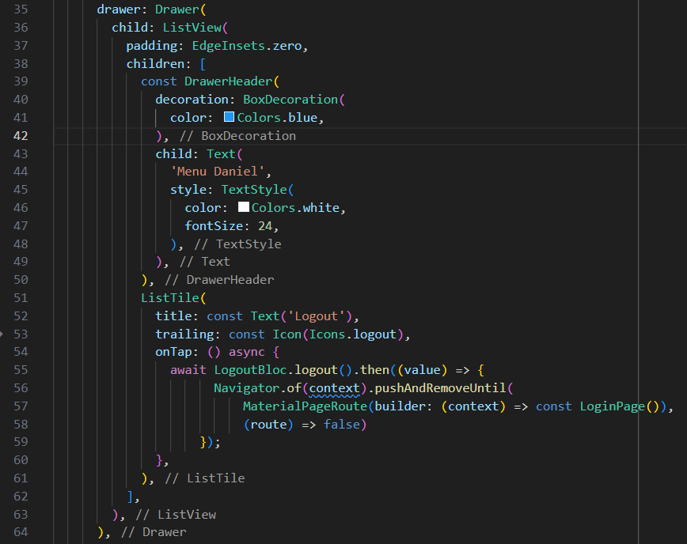

- Halaman Tambah Produk

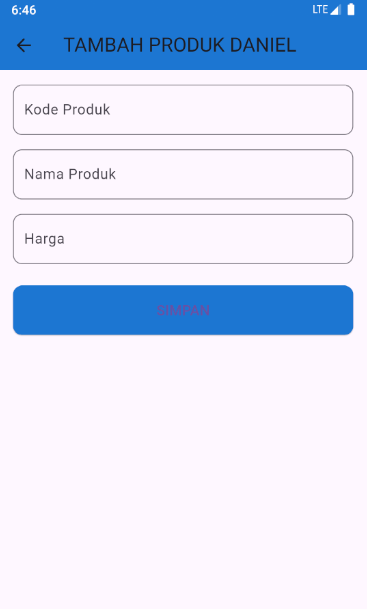

Pada halaman Tambah Produk, user dapat menambahkan data produk untuk disimpan di database dengan mengisi form tambah produk yang berisi kolom kode produk, nama produk, dan harga.

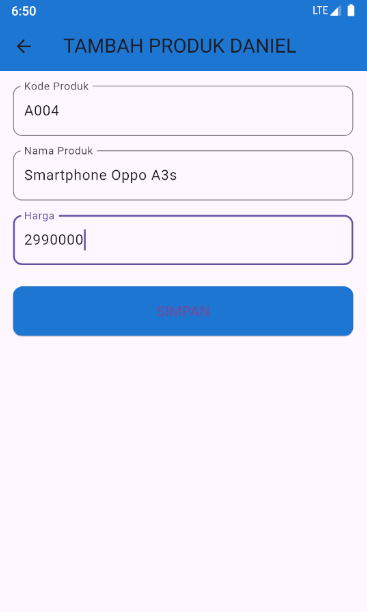

Setelah user melakukan input ke form tambah produk dan menekan tombol Simpan, user akan secara otomatis diarahkan ke halaman Daftar Produk apabila data yang dimasukkan valid.

Berikut adalah halaman Daftar Produk setelah user melakukan proses tambah produk untuk menambah produk "Smartphone Oppo A3s".

Berikut adalah baris kode untuk proses simpan data produk baru. Fungsi simpan() digunakan untuk mengumpulkan data produk dari form input, mengirim data tersebut untuk disimpan melalui ProdukBloc, menangani error jika proses gagal, dan memperbarui status UI seperti indikator loading. Setelah proses berhasil, pengguna akan diarahkan ke halaman produk yang menampilkan daftar produk yang telah disimpan.

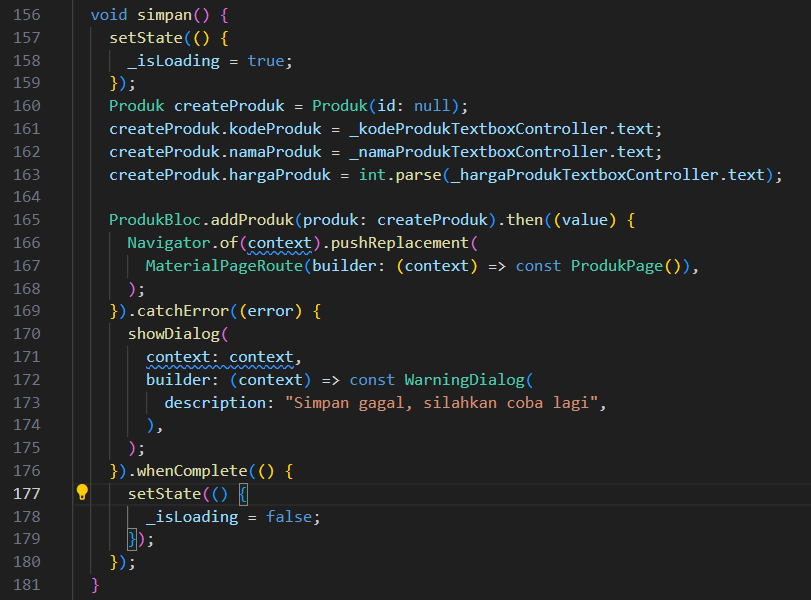

- Halaman Detail Produk

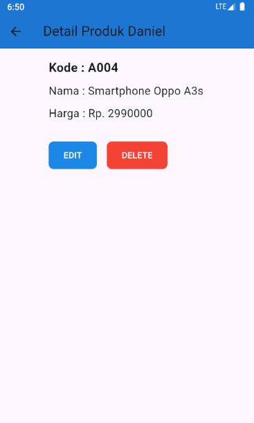

User dapat mengakses halaman Detail Produk dari salah satu produk dengan menekan salah satu dari beberapa produk yang ada di halaman Daftar Produk. Pada halaman Detail Produk, ditampilkan informasi mengenai produk yaitu, kode, nama produk, dan harga produk. Kemudian terdapat tombol "Edit" dan tombol "Hapus".

- Ubah Data Produk

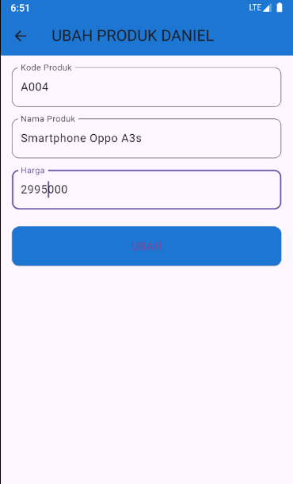

User dapat mengakses halaman Ubah Produk dengan menekan tombol "Edit" pada halaman Detail Produk. Pada halaman ini, user dapat mengedit data produk dengan merubah isi form yang berisi data produk dengan data baru, kemudian menekan tombol "Ubah". Apabila data baru yang diinputkan user adalah valid, maka proses edit data akan berhasil dan user akan otomatis menuju ke halaman Daftar Produk.

Sebagai contoh setelah harga produk diubah, maka pada halaman Daftar Produk, datanya akan diperbarui seperti pada gambar di bawah:

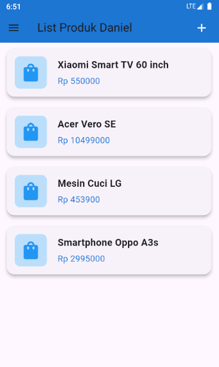

Berikut ini adalah kode untuk proses ubah data produk. Fungsi ubah() digunakan untuk memperbarui data produk yang sudah ada. Fungsi ini mengumpulkan data dari form input, memperbarui produk melalui ProdukBloc, dan menangani berbagai skenario seperti sukses, gagal, serta memastikan status loading dikelola dengan benar. Setelah produk berhasil diupdate, pengguna akan diarahkan kembali ke halaman produk.

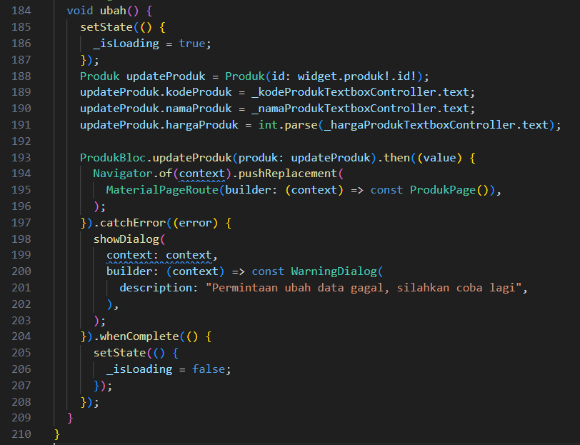

- Hapus Data Produk

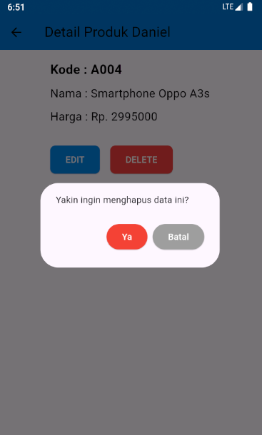

Unruk menghapus data produk, user harus menekan tombol "Delete" yang ada di halaman Detail Produk. Setelah ditekan, akan muncul notifikasi untuk mengonfirmasi aksi hapus data produk. Apabila user memilih "Ya", maka data produk akan dihapus dari database, jika user memilih "Batal", proses hapus data produk tidak jadi dieksekusi dan data produk tidak jadi dihapus.

Berikut ini adalah kode untuk proses hapus data produk. Fungsi confirmHapus() menampilkan dialog konfirmasi yang meminta pengguna memastikan tindakan penghapusan produk. Jika pengguna memilih "Ya", produk akan dihapus melalui ProdukBloc, dan jika berhasil, pengguna akan diarahkan kembali ke halaman produk. Jika terjadi kesalahan, dialog peringatan akan muncul. Tombol "Batal" memungkinkan pengguna membatalkan penghapusan tanpa melakukan perubahan apa pun.

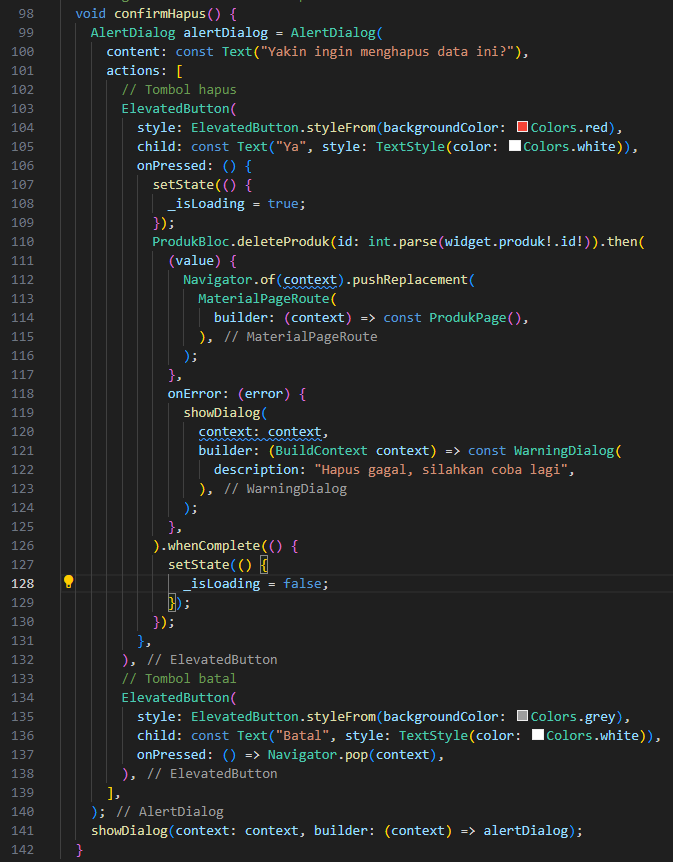